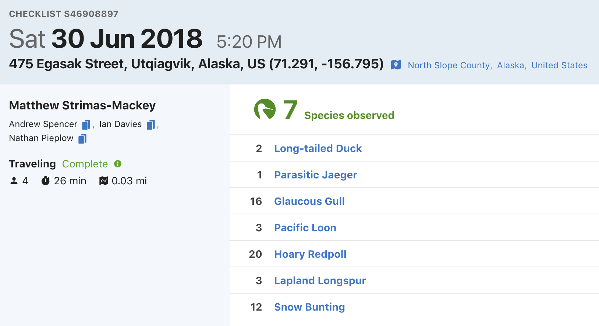

# eBird Data {#ebird}

## Introduction {#ebird-intro}

eBird data are collected and organized around the concept of a checklist, representing observations from a single birding event, such as a 1 km walk through a park or 15 minutes observing bird feeders in your backyard. Each checklist contains a list of species observed, counts of the number of individuals seen of each species, the location and time of the observations, and a measure of the effort expended while collecting these data. The following image depicts a typical eBird checklist as viewed [on the eBird website](https://ebird.org/view/checklist/S46908897):



Although eBird collects semi-structured citizen science data, three elements of eBird checklists distinguish them from similar sources. First, eBird checklist require users to specify the survey protocol they used, whether it's traveling, stationary, incidental (i.e. if the observations were collected when birding was not the primary activity), or one of the other protocols. Second, in addition to typical information on when and where the data were collected, checklists contain effort information specifying how long the observer searched, how far they traveled, and how many observers were part of the party. Finally, observers are asked to indicate whether they are reporting all the birds they were able to identify. Checklists with all species reported, known as **complete checklists**, enable researchers to identify which species were not detected (rather than just not reported). These inferred non-detections allow data to be *zero-filled*, so there's a zero count for any species not recorded. Complete checklists with effort information facilitate robust analyses, and thus represent the gold standard of eBird checklists. Because of these factors, eBird data are often referred to as **semi-structured** [@kellingFindingSignalNoise2018].

Access to the complete set of eBird observations is provided via the [eBird Basic Dataset (EBD)](https://ebird.org/science/download-ebird-data-products). This is a tab-separated text file, released monthly, containing all validated bird sightings in the eBird database at the time of release. Each row corresponds to the sighting of a single species within a checklist and, in addition to the species and number of individuals reported, information is provided about the checklist (location, time, date, search effort, etc.). An additional file, the Sampling Event Data (SED), provides just the checklist data. In this file, each row corresponds to a checklist and only the checklist variables are included, not the associated species data. For complete checklists, the SED provides the full set of checklists in the database, which is needed to zero-fill the data. In particular, if a checklist appears in the SED as complete, but has no records in the EBD for a given species, we can infer that there is a 0 count for that species on that checklist. In addition, checklists with no species recorded (yes, these do exist), will not appear in the EBD, so the SED is required to identify these checklists.

In the previous chapter, we described how to [access and download the EBD](#intro-setup-ebird). In this chapter, we'll demonstrate how to use the R package [`auk`](https://cornelllabofornithology.github.io/auk/) to extract subsets of the data for analysis. Next, we'll show how to import the data into R and perform some pre-processing steps required to ensure proper analysis of the data. Finally, we'll zero-fill the data to produce presence-absence eBird data suitable for modeling species distribution and abundance. In the interest of making examples concrete, throughout this chapter, and those that follow, we'll use the specific example of [Wood Thrush](https://www.allaboutbirds.org/guide/Wood_Thrush/) in [Bird Conservation Region (BCR)](http://nabci-us.org/resources/bird-conservation-regions/) 27 ("Southeastern Coastal Plains") in June for our analyses. Before we get started, we suggest creating a new [RStudio project](https://www.tidyverse.org/articles/2017/12/workflow-vs-script/) for following along with these examples; this will ensure your working directory is always the project directory and allow us to use relative paths.

### eBird taxonomy {#ebird-intro-tax}

eBird uses its own [taxonomic system](https://ebird.org/science/the-ebird-taxonomy), updated annually after expert review every August. A notable benefit of these annual, system-wide updates is that splits and lumps are nearly instantly propagated across the entire eBird database. When necessary, expert reviewers manually sort through observations and assign records to current taxonomic hypotheses to the extent possible. This ensures that both new and historical eBird data conform to the updated taxonomy. In addition, after the taxonomy update, both the EBD and `auk` are updated to reflect the changes.

We emphasize that for any eBird analysis, you should consider the taxonomy of your study organisms, and whether you're accessing the intended data from eBird. For example, are you interested in all [Willets](https://www.allaboutbirds.org/guide/Willet/) or do you want to treat the eastern and western populations separately since they're completely allopatric on their breeding grounds? Do you want to do an analysis combining [Greater](https://www.allaboutbirds.org/guide/Greater_Yellowlegs/) and [Lesser Yellowlegs](https://www.allaboutbirds.org/guide/Lesser_Yellowlegs/)? eBirders have the option of recording observations for taxa above (e.g. at genus level) or below (e.g. at subspecies level) the species level. These more granular taxonomic assignments are available in the EBD. In many cases taxonomic differences can be dealt with by querying specific subspecies, or multiple species, and splitting and lumping after the query as necessary. However, note that the majority of eBird users don't assign their observations to subspecies, so querying taxa below species will result in a much smaller dataset.

If you're not interested in these taxonomic nuances, `auk` will handle the taxonomy seamlessly for you by resolving all observations to species level. Indeed, for the example in this chapter, we'll use all Wood Thrush observations and not delve into taxonomic issues further.

## Data extraction with `auk` {#ebird-extract}

eBird contains an impressive amount of data (over 600 million bird observations!); however, this makes the EBD particularly challenging to work with due to its sheer size (over 200 GB!). Text files of this size can't be opened in R, Excel, or most other software. Fortunately, the R package `auk` has been specifically designed to extract subsets of data from the EBD for analysis using the Unix command line text processing utility AWK. The goal when using `auk` should always be to subset the full EBD down to a manageable size, small enough that it can be imported into R for further processing or analysis. In our case, that will mean extracting Wood Thrush records from BCR 27 in June.

Filtering the EBD using `auk` requires three steps. First, reference the EBD and SED using the function `auk_ebd()`. If you've followed the instruction in the [Introduction](#intro) for [downloading eBird data](#intro-setup-ebird), you'll have these files on your computer and will have pointed `auk` to the directory they're stored in using `auk_set_ebd_path()`. If you intend to zero-fill the data, you'll need to pass both the EBD and SED to `auk_ebd()`, this ensures that the same set of filters is applied to both files so they contain the same population of checklists. **It is critical that the EBD and SED are both from the same release of the eBird data.**

If you don't have enough hard drive space to store the full eBird data set, which is more than 200 GB, or don't have a fast enough internet connection to download it, consult the section on [using the Custom Download form](#ebird-size-custom) for an alternative approach to filtering eBird data.

Before running any of the following code, create an [RStudio project](https://r4ds.had.co.nz/workflow-projects.html) for following along with this book. The project will be a self contained space for all the code, input data, and outputs that comprise the lessons in this book. In addition, using a project will ensure your working directory is set to the project directory.

```{r ebird-extract-ebd}
library(auk)
library(lubridate)
library(sf)
library(gridExtra)
library(tidyverse)
# resolve namespace conflicts
select <- dplyr::select

# setup data directory
dir.create("data", showWarnings = FALSE)

ebd <- auk_ebd("ebd_relSep-2019.txt", 
               file_sampling = "ebd_sampling_relSep-2019.txt")
```

Next, define the filters that you want to apply to the EBD. Each field that you can filter on has an associated function. For example, we'll filter to Wood Thrush observations with `auk_species()`, from BCR 27 with `auk_bcr()`, in June of any year with `auk_date()`, restrict observations to those from either Stationary or Traveling protocols with `auk_protocol()`, and only keep complete checklists with `auk_complete()` since we intend to zero-fill the data. For a full list of possible filters, [consult the package documentation](https://cornelllabofornithology.github.io/auk/reference/index.html#section-filter).

```{r ebird-extract-define}
ebd_filters <- ebd %>% 
  auk_species("Wood Thrush") %>% 
  # southeastern coastal plain bcr
  auk_bcr(bcr = 27) %>% 
  # june, use * to get data from any year
  auk_date(date = c("*-06-01", "*-06-30")) %>% 
  # restrict to the standard traveling and stationary count protocols
  auk_protocol(protocol = c("Stationary", "Traveling")) %>% 
  auk_complete()
ebd_filters
```

Note that printing the object `ebd_filters` shows what filters have been set. At this point, we've only defined the filters, not applied them to the EBD. The last step is to use `auk_filter()` to compile the filters into an AWK script and run it to produce two output files: one for the EBD and one for the SED. **This step typically takes several hours to run since the files are so large.** As a result, it's wise to wrap this in an `if` statement, so it's only run once. As noted in the [Introduction](intro-setup-software), Windows users will need to [install Cygwin](https://www.cygwin.com/) for this next step to work.

```{r ebird-extract-filter}
# output files
data_dir <- "data"
if (!dir.exists(data_dir)) {
  dir.create(data_dir)
}
f_ebd <- file.path(data_dir, "ebd_woothr_june_bcr27.txt")
f_sampling <- file.path(data_dir, "ebd_checklists_june_bcr27.txt")

# only run if the files don't already exist
if (!file.exists(f_ebd)) {
  auk_filter(ebd_filters, file = f_ebd, file_sampling = f_sampling)
}
```

Throughout this filtering process we've kept the EBD (i.e. the observation data) and the SED (i.e. the checklist data) together. This is because it's critical that the same set of filters get applied to both datasets to ensure that we're working with the same population of checklists when we zero-fill to produce presence-absence data. However, some filters don't apply to the checklist data, notably `auk_species()`, so these are simply skipped when the filters are compiled and run on the SED.

These files are now a few megabytes rather than hundreds of gigabytes, which means they can easily be read into R! Don't feel like waiting for `auk_filter()` to run? [Download the data package](https://github.com/cornelllabofornithology/ebird-best-practices/raw/master/data/data.zip) mentioned in the introduction to get a copy of the EBD subset for Wood Thrush in June in BCR27 and proceed to the next section; just make sure you load the packages in the first code chunk before proceeding.

## Importing and zero-filling {#ebird-zf}

The previous step left us with two tab separated text files, one for the EBD and one for the SED. Next, we'll use [`auk_zerofill()`](https://cornelllabofornithology.github.io/auk/reference/auk_zerofill.html) to read these two files into R and combine them together to produce zero-filled, detection/non-detection data (also called presence/absence data). To just read the EBD or SED, but not combine them, use [`read_ebd()`](https://cornelllabofornithology.github.io/auk/reference/read_ebd.html) or [`read_sampling()`](https://cornelllabofornithology.github.io/auk/reference/read_ebd.html), respectively.

```{r ebird-zf}
ebd_zf <- auk_zerofill(f_ebd, f_sampling, collapse = TRUE)
```

When any of the read functions from `auk` are used, two important processing steps occur by default behind the scenes. First, eBird observations can be made at levels below species (e.g. subspecies) or above species (e.g. a bird that was only identified as Duck sp.); however, for most uses we'll want observations at the species level. [`auk_rollup()`](https://cornelllabofornithology.github.io/auk/reference/auk_rollup.html) is applied by default when [`auk_zerofill()`](https://cornelllabofornithology.github.io/auk/reference/auk_zerofill.html) is used, and it drops all observations not identifiable to a species and rolls up all observations reported below species to the species level. eBird also allows for [group checklists](https://help.ebird.org/customer/en/portal/articles/1010555-understanding-the-ebird-checklist-sharing-process), those shared by multiple users. These checklists lead to duplication or near duplication of records within the dataset and the function [`auk_unique()`](https://cornelllabofornithology.github.io/auk/reference/auk_unique.html), applied by default by [`auk_zerofill()`](https://cornelllabofornithology.github.io/auk/reference/auk_zerofill.html), addresses this by only keeping one independent copy of each checklist. Finally, by default [`auk_zerofill()`](https://cornelllabofornithology.github.io/auk/reference/auk_zerofill.html) returns a compact representation of the data, consisting of a list of two data frames, one with checklist data and the other with observation data; the use of `collapse = TRUE` combines these into a single data frame, which will be easier to work with.

Before continuing, we'll transform some of the variables to a more useful form for modelling. We convert time to a decimal value between 0 and 24, and we force the distance travelled to 0 for stationary checklists. Notably, eBirders have the option of entering an "X" rather than a count for a species, to indicate that the species was present, but they didn't keep track of how many individuals were observed. During the modeling stage, we'll want the `observation_count` variable stored as an integer and we'll convert "X" to `NA` to allow for this.

```{r ebird-zf-transform}
# function to convert time observation to hours since midnight
time_to_decimal <- function(x) {
  x <- hms(x, quiet = TRUE)
  hour(x) + minute(x) / 60 + second(x) / 3600
}

# clean up variables
ebd_zf <- ebd_zf %>% 
  mutate(
    # convert X to NA
    observation_count = if_else(observation_count == "X", 
                                NA_character_, observation_count),
    observation_count = as.integer(observation_count),
    # effort_distance_km to 0 for non-travelling counts
    effort_distance_km = if_else(protocol_type != "Traveling", 
                                 0, effort_distance_km),
    # convert time to decimal hours since midnight
    time_observations_started = time_to_decimal(time_observations_started),
    # split date into year and day of year
    year = year(observation_date),
    day_of_year = yday(observation_date)
  )
```

## Accounting for variation in detectability {#ebird-detect}

As discussed in the [Introduction](#intro-intro), variation in effort between checklists makes inference challenging, because it is associated with variation in detectability. When working with semi-structured datasets like eBird, one approach to dealing with this variation is to impose some more consistent structure on the data by filtering observations on the effort variables. This reduces the variation in detectability between checklists. Based on our experience working with these data, we suggest restricting checklists to less than 5 hours long and 5 km in length, and with 10 or fewer observers. Furthermore, we'll only consider data from the past 10 years (2010-2019).

```{r ebird-detect}
# additional filtering
ebd_zf_filtered <- ebd_zf %>% 
  filter(
    # effort filters
    duration_minutes <= 5 * 60,
    effort_distance_km <= 5,
    # last 10 years of data
    year >= 2010,
    # 10 or fewer observers
    number_observers <= 10)
```

Finally, there are a large number of variables in the EBD that are redundant (e.g. both state names *and* codes are present) or unnecessary for most modeling exercises (e.g. checklist comments and Important Bird Area codes). These can be removed at this point, keeping only the variables we want for modelling. Then we'll save the resulting zero-filled observations for use in later chapters.

```{r ebird-detect-clean}
ebird <- ebd_zf_filtered %>% 
  select(checklist_id, observer_id, sampling_event_identifier,
         scientific_name,
         observation_count, species_observed, 
         state_code, locality_id, latitude, longitude,
         protocol_type, all_species_reported,
         observation_date, year, day_of_year,
         time_observations_started, 
         duration_minutes, effort_distance_km,
         number_observers)
write_csv(ebird, "data/ebd_woothr_june_bcr27_zf.csv", na = "")
```

If you'd like to ensure you're using exactly the same data as was used to generate this book, download the [data package](https://github.com/cornelllabofornithology/ebird-best-practices/raw/master/data/data.zip) mentioned in the [setup instructions](#intro-setup-data) and place the contents in the `data/` subdirectory of your project directory.

## Exploratory analysis and visualization {#ebird-explore}

Before proceeding to fitting species distribution models with these data, it's worth exploring the dataset to see what we're working with. Let's start by making a simple map of the observations. This map uses GIS data available for [download in the data package](https://github.com/cornelllabofornithology/ebird-best-practices/raw/master/data/data.zip). Place the contents of the zip file in the `data/` subdirectory of your project directory. 

```{r ebird-explore-map}
# load and project gis data
map_proj <- st_crs(102003)
ne_land <- read_sf("data/gis-data.gpkg", "ne_land") %>% 
  st_transform(crs = map_proj) %>% 
  st_geometry()
bcr <- read_sf("data/gis-data.gpkg", "bcr") %>% 
  st_transform(crs = map_proj) %>% 
  st_geometry()
ne_country_lines <- read_sf("data/gis-data.gpkg", "ne_country_lines") %>% 
  st_transform(crs = map_proj) %>% 
  st_geometry()
ne_state_lines <- read_sf("data/gis-data.gpkg", "ne_state_lines") %>% 
  st_transform(crs = map_proj) %>% 
  st_geometry()

# prepare ebird data for mapping
ebird_sf <- ebird %>% 
  # convert to spatial points
  st_as_sf(coords = c("longitude", "latitude"), crs = 4326) %>% 
  st_transform(crs = map_proj) %>% 
  select(species_observed)

# map
par(mar = c(0.25, 0.25, 0.25, 0.25))
# set up plot area
plot(st_geometry(ebird_sf), col = NA)
# contextual gis data
plot(ne_land, col = "#dddddd", border = "#888888", lwd = 0.5, add = TRUE)
plot(bcr, col = "#cccccc", border = NA, add = TRUE)
plot(ne_state_lines, col = "#ffffff", lwd = 0.75, add = TRUE)
plot(ne_country_lines, col = "#ffffff", lwd = 1.5, add = TRUE)
# ebird observations
# not observed
plot(st_geometry(ebird_sf),
     pch = 19, cex = 0.1, col = alpha("#555555", 0.25),
     add = TRUE)
# observed
plot(filter(ebird_sf, species_observed) %>% st_geometry(),
     pch = 19, cex = 0.3, col = alpha("#4daf4a", 1),
     add = TRUE)
# legend
legend("bottomright", bty = "n",
       col = c("#555555", "#4daf4a"),
       legend = c("eBird checklists", "Wood Thrush sightings"),
       pch = 19)
box()
par(new = TRUE, mar = c(0, 0, 3, 0))
title("Wood Thrush eBird Observations\nJune 2010-2019, BCR 27")
```

In this map, the spatial bias in eBird data becomes immediately obvious, for example, notice the large number of checklists along the heavily populated Atlantic coast, especially around large cities like Jacksonville, Florida and popular birding areas like the Outer Banks of North Carolina. 

Exploring the effort variables is also a valuable exercise. For each effort variable, we'll produce both a histogram and a plot of frequency of detection as a function of that effort variable. The histogram will tell us something about birder behavior. For example, what time of day are most people going birding, and for how long? We may also want to note values of the effort variable that have very few observations; predictions made in these regions may be unreliable due to a lack of data. The detection frequency plots tell us how the probability of detecting a species changes with effort.

### Time of day {#ebird-explore-time}

The chance of an observer detecting a bird when present can be highly dependent on time of day. For example, many species exhibit a peak in detection early in the morning during dawn chorus and a secondary peak early in the evening. With this in mind, the first predictor of detection that we'll explore is the time of day at which a checklist was started. We'll summarize the data in 1 hour intervals, then plot them. Since estimates of detection frequency are unreliable when only a small number of checklists are available, we'll only plot hours for which at least 100 checklists are present.

```{r ebird-explore-time, fig.asp = 1}
# summarize data by hourly bins
breaks <- 0:24
labels <- breaks[-length(breaks)] + diff(breaks) / 2
ebird_tod <- ebird %>% 
  mutate(tod_bins = cut(time_observations_started, 
                         breaks = breaks, 
                        labels = labels,
                         include.lowest = TRUE),
         tod_bins = as.numeric(as.character(tod_bins))) %>% 
  group_by(tod_bins) %>% 
  summarise(n_checklists = n(),
            n_detected = sum(species_observed),
            det_freq = mean(species_observed))

# histogram
g_tod_hist <- ggplot(ebird_tod) +
  aes(x = tod_bins, y = n_checklists) +
  geom_col(width = mean(diff(breaks)), color = "grey30", fill = "grey50") +
  scale_x_continuous(breaks = seq(0, 24, by = 3), limits = c(0, 24)) +
  scale_y_continuous(labels = scales::comma) +
  labs(x = "Hours since midnight",
       y = "# checklists",
       title = "Distribution of observation start times")

# frequency of detection
g_tod_freq <- ggplot(ebird_tod %>% filter(n_checklists > 100)) +
  aes(x = tod_bins, y = det_freq) +
  geom_line() +
  geom_point() +
  scale_x_continuous(breaks = seq(0, 24, by = 3), limits = c(0, 24)) +
  scale_y_continuous(labels = scales::percent) +
  labs(x = "Hours since midnight",
       y = "% checklists with detections",
       title = "Detection frequency")

# combine
grid.arrange(g_tod_hist, g_tod_freq)
```

As expected, Wood Thrush detectability is highest early in the morning and quickly falls off as the day progresses. In later chapters, we'll make predictions at the peak time of day for detecatibility to limit the effect of this variation. The majority of checklist submissions also occurs in the morning; however, there are reasonable numbers of checklists between 5am and 9pm. It's in this region that our model estimates will be most reliable.

### Checklist duration {#ebird-explore-duration}

When we initially extracted the eBird data in Section \@ref(ebird-extract), we restricted observations to those from checklists 5 hours in duration or shorter to reduce variability. Let's see what sort of variation remains in checklist duration.

```{r ebird-explore-duration, fig.asp = 1}
# summarize data by 30 minute bins
breaks <- seq(0, 5, by = 0.5)
labels <- breaks[-length(breaks)] + diff(breaks) / 2
ebird_dur <- ebird %>% 
  mutate(dur_bins = cut(duration_minutes / 60, 
                        breaks = breaks, 
                        labels = labels,
                        include.lowest = TRUE),
         dur_bins = as.numeric(as.character(dur_bins))) %>% 
  group_by(dur_bins) %>% 
  summarise(n_checklists = n(),
            n_detected = sum(species_observed),
            det_freq = mean(species_observed))

# histogram
g_dur_hist <- ggplot(ebird_dur) +
  aes(x = dur_bins, y = n_checklists) +
  geom_col(width = mean(diff(breaks)), color = "grey30", fill = "grey50") +
  scale_x_continuous(breaks = 0:5) +
  scale_y_continuous(labels = scales::comma) +
  labs(x = "Checklist duration (hours)",
       y = "# checklists",
       title = "Distribution of checklist durations")

# frequency of detection
g_dur_freq <- ggplot(ebird_dur %>% filter(n_checklists > 100)) +
  aes(x = dur_bins, y = det_freq) +
  geom_line() +
  geom_point() +
  scale_x_continuous(breaks = 0:5) +
  scale_y_continuous(labels = scales::percent) +
  labs(x = "Checklist duration (hours)",
       y = "% checklists with detections",
       title = "Detection frequency")

# combine
grid.arrange(g_dur_hist, g_dur_freq)
```

The majority of checklists are half an hour or shorter and there is a rapid decline in the frequency of checklists with increasing duration. In addition, longer searches yield a higher chance of detecting a Wood Thrush. In many cases, there is a saturation effect, with searches beyond a given length producing little additional benefit; however, here there appears to be a drop off in detection for checklists longer than 4 hours.

### Distance traveled {#ebird-explore-distance}

As with checklist duration, we expect *a priori* that the greater the distance someone travels, the greater the probability of encountering at least one Wood Thrush. Let's see if this expectation is met. Note that we have already truncated the data to checklists less than 5 km in length.

```{r ebird-explore-distance, fig.asp = 1}
# summarize data by 500m bins
breaks <- seq(0, 5, by = 0.5)
labels <- breaks[-length(breaks)] + diff(breaks) / 2
ebird_dist <- ebird %>% 
  mutate(dist_bins = cut(effort_distance_km, 
                         breaks = breaks, 
                         labels = labels,
                         include.lowest = TRUE),
         dist_bins = as.numeric(as.character(dist_bins))) %>% 
  group_by(dist_bins) %>% 
  summarise(n_checklists = n(),
            n_detected = sum(species_observed),
            det_freq = mean(species_observed))

# histogram
g_dist_hist <- ggplot(ebird_dist) +
  aes(x = dist_bins, y = n_checklists) +
  geom_col(width = mean(diff(breaks)), color = "grey30", fill = "grey50") +
  scale_x_continuous(breaks = 0:5) +
  scale_y_continuous(labels = scales::comma) +
  labs(x = "Distance travelled (km)",
       y = "# checklists",
       title = "Distribution of distance travelled")

# frequency of detection
g_dist_freq <- ggplot(ebird_dist %>% filter(n_checklists > 100)) +
  aes(x = dist_bins, y = det_freq) +
  geom_line() +
  geom_point() +
  scale_x_continuous(breaks = 0:5) +
  scale_y_continuous(labels = scales::percent) +
  labs(x = "Distance travelled (km)",
       y = "% checklists with detections",
       title = "Detection frequency")

# combine
grid.arrange(g_dist_hist, g_dist_freq)
```

As with duration, the majority of observations are from short checklists (less than half a kilometer). One fortunate consequence of this is that most checklists will be contained within a small area within which habitat is not likely to show high variability. In chapter \@ref{covariates}, we will summarize land cover data within circles 2.5 km in diameter, centered on each checklist, and it appears that the vast majority of checklists will stay contained within this area.

### Number of observers {#ebird-explore-observers,}

Finally, let's consider the number of observers whose observation are being reported in each checklist. We expect that at least up to some number of observers, reporting rates will increase; however, in working with these data we have found cases of declining detection rates for very large groups. With this in mind we have already restricted checklists to those with 10 or fewer observers, thus removing the very largest groups (prior to filtering, some checklists had as many as 230 observers!).

```{r ebird-explore-observers, fig.asp = 1}
# summarize data
breaks <- 0:10
labels <- 1:10
ebird_obs <- ebird %>% 
  mutate(obs_bins = cut(number_observers, 
                        breaks = breaks, 
                        label = labels,
                        include.lowest = TRUE),
         obs_bins = as.numeric(as.character(obs_bins))) %>% 
  group_by(obs_bins) %>% 
  summarise(n_checklists = n(),
            n_detected = sum(species_observed),
            det_freq = mean(species_observed))

# histogram
g_obs_hist <- ggplot(ebird_obs) +
  aes(x = obs_bins, y = n_checklists) +
  geom_col(width = mean(diff(breaks)), color = "grey30", fill = "grey50") +
  scale_x_continuous(breaks = 1:10) +
  scale_y_continuous(labels = scales::comma) +
  labs(x = "# observers",
       y = "# checklists",
       title = "Distribution of the number of observers")

# frequency of detection
g_obs_freq <- ggplot(ebird_obs %>% filter(n_checklists > 100)) +
  aes(x = obs_bins, y = det_freq) +
  geom_line() +
  geom_point() +
  scale_x_continuous(breaks = 1:10) +
  scale_y_continuous(labels = scales::percent) +
  labs(x = "# observers",
       y = "% checklists with detections",
       title = "Detection frequency")

# combine
grid.arrange(g_obs_hist, g_obs_freq)
```

There is no discernable pattern amongst the noise here, likely because there are so few checklists with more than 3 observers.

## EBD file size issues {#ebird-size}

The full EBD is massive (over 200 GB!) and takes a long time to process with `auk` (typically several hours). Furthermore, it's onerous to download and uncompress the file, and many users won't have space on their hard drive to store the file.  Fortunately, there are a variety of ways of addressing these file size issues. In this section, we'll demonstrate how to [use the Custom Download form](#ebird-size-custom) to download only a subset of the eBird data. In addition, we'll cover some methods for reducing the size of both the EBD and extracts from the EBD. Specifically, we'll cover [stricter filtering](#ebird-size-strict), [removing columns](#ebird-size-dropcols), and [splitting by species](#ebird-filter-split).

### Custom downloads {#ebird-size-custom}

On the [EBD download page](https://ebird.org/data/download/ebd), there's a Custom Download form that allows you to request a subset of the EBD for a given species, within a region, and/or for a range of dates. After submitting a request, it will be processed on the eBird servers and an email will be sent to you with instructions for downloading the EBD extract.


In many cases, using the custom download form can circumvent the need for downloading the full EBD; however, there are two important caveats. First, this approach doesn't give the full range of filters that are available in auk, it only allows you to get data for a single species, within a single region, for a range of dates. Second, a custom download request will only provide observation data from the EBD, the associated Sampling Event Data (SED) required for zero-filling is not provided. Fortunately, both these issues can be addressed using the following method.

1. Submit a custom download request that narrows down the data you'll receive as much as possible. For the example in this chapter, we'll request Wood Thrush data from the United States (since BCR 27 is entirely within the US). Note that the custom download form has a date filter, but it allows us to select data from a range of dates, hence we can't specify June of *any* year, so we'll leave this blank. Fill out the form as in the above image. If you intend to later zero-fill these data, **it's critical that you don't apply stricter filters in the custom download form than you eventually intend to use during auk filtering**. 
2. You will receive an email (typically within 15 minutes) with instructions for downloading the requested data. Download and uncompress the data, then place the resulting data file in the `data/` subdirectory of your RStudio project. The data will be in a file named similarly to the EBD, for example, `ebd_US_woothr_relSep-2019.txt`. Note the date in the filename (`Sep-2019` in this case), which specifies the version of the EBD we're working with. Also, note the size of this file is about 300 MB, nearly 1000 times smaller than the full EBD!
3. Ensure that you have a copy of the SED that is the same version as the file you just downloaded. In particular, the two files should have the same date in their filenames (`Sep-2019` in our example). If you don't already have the correct SED version, [download a fresh copy](https://ebird.org/data/download/ebd) and place it in the EBD directory we [specified in the introduction](#intro-setup-ebird) (you can see the location of this directory with `auk::auk_get_ebd_path()`).
4. Now you can follow along with this chapter, starting at the beginning, with one simple change. In the [first chunk of R code](#ebird-extract), when the `ebd` object is defined, change the EBD filename to the file from the custom download request.

```{r ebird-size-custom, eval = FALSE}
ebd <- auk_ebd("data/ebd_US_woothr_relSep-2019.txt", 
               file_sampling = "ebd_sampling_relSep-2019.txt")
```

Using the above steps, we can produce the exact same results without have to download and filter the the full EBD!

### Stricter filtering {#ebird-size-strict}

If, after filtering, you're EBD extract is still too large to read into R, the most obvious way to reduce the size is to use stricter filters: focus on a smaller region, shorter time period, or fewer species. To avoid having to waste several hours trying to filter the entire EBD all over again, it's worthwhile noting that you can always re-filter an EBD extract directly. So, if you realize you were too coarse in your initial filtering, apply the stricter filter to the EBD extract rather than the full EBD so save time.

### Removing columns {#ebird-size-columns}

The EBD contains a lot of columns (46 to be precise), many of which are redundant or not useful in most scenarios. For example, country, state, and county each have two columns, one for the name and one for the code. Other columns, such as the Important Bird Area (IBA) that a checklist belong to and the checklist comments, are rarely useful. By removing these columns we can drastically reduce the size of the EBD.

The available columns in the EBD are listed and defined in the PDF metadata that comes with the EBD (`eBird_Basic_Dataset_Metadata_v1.12.pdf`). Alternatively, there's a useful trick to get a list of column names from an `auk_ebd` object.

```{r ebird-size-columns-cols}
ebd$col_idx$name
```

The function `auk_select()` will process the EBD to only keep the selected columns. For example, we can apply this to our Wood Thrush EBD extract to keep a minimal set of columns

```{r ebird-size-columns-select}
cols <- c("latitude", "longitude",
          "group identifier", "sampling event identifier", 
          "scientific name", "observation count",
          "observer_id")
f_select <- "data/ebd_smaller.txt"
selected <- auk_ebd(f_ebd) %>% 
  auk_select(select = cols, file = f_select) %>% 
  read_ebd()
glimpse(selected)
# file size difference
file.size(f_ebd) / file.size(f_select)
```

So, by removing columns, we've reduced the size of the EBD extract by a factor of almost `r ceiling(file.size(f_ebd) / file.size(f_select))`. `auk_select()` is typically applied to a subset of the EBD to reduce the size before reading it into R. However, this function can also be applied to *entire* EBD to remove any columns that you're sure you'll never need. If you're running out of hard drive space, this approach can drastically reduce the size of the EBD and free up space.

Selecting columns can also be done simultaneously with filtering by using the `keep` and `drop` arguments to `auk_fiter()`. Consult the function documentation for details.

```{r ebird-size-columns-clean, echo = FALSE}
unlink(f_select)
```

### Splitting by species {#ebird-size-split}

If you're working with a large number of species, the size of extracts from the global EBD can quickly increase. An easy way to address this before importing data into R is to split the EBD extract up into separate files, one for each species. You can then read in species one at a time and process them. Note that the Sampling Event Data doesn't need to be split and the same file can be used for each species EBD file.

The function `auk_split()` facilitates this process. You provide an EBD extract and a vector of species names and it will split the EBD up into species-specific files. This approach is much faster because we only need to filter the EBD once instead of once for each species. This could be the difference between a few hours of processing time and a few days. Consult the `auk_split()` function documentation for details.